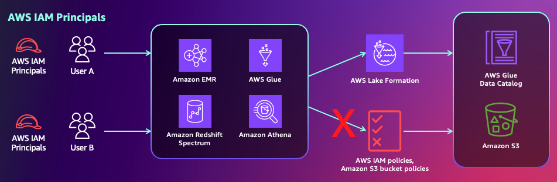
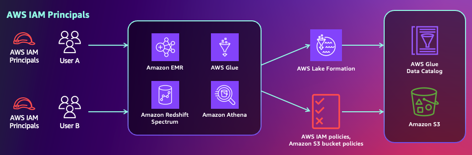
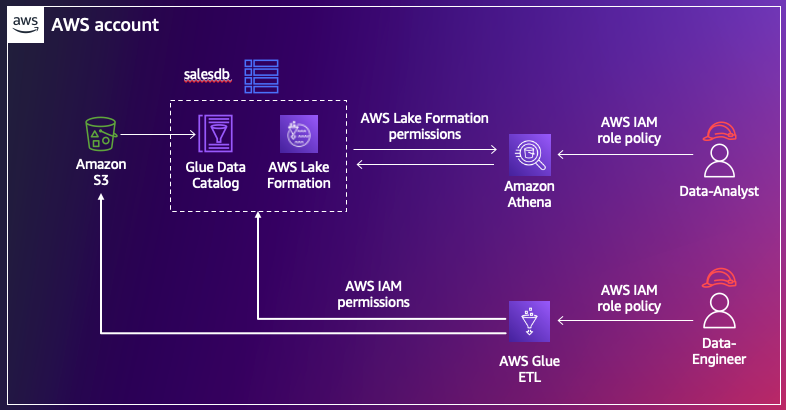
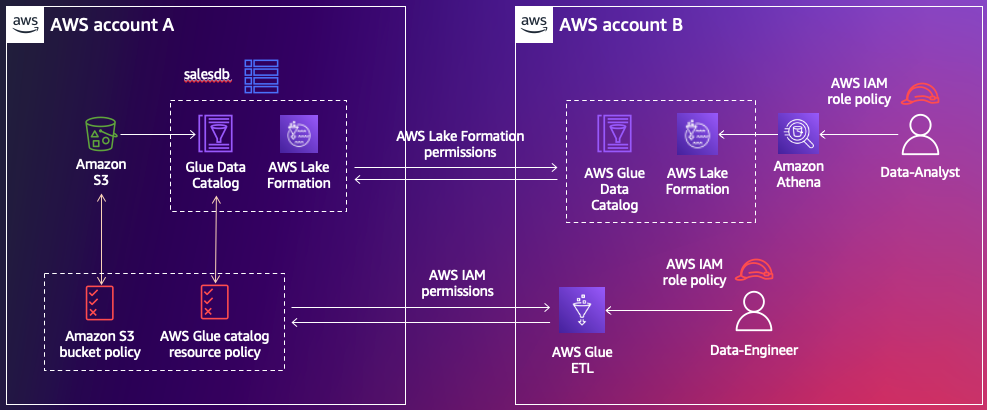

# Lake Formation adoption modes

Before Lake Formation was available, users of Glue Data Catalog can use a combination of Data Catalog resource policies and IAM permissions (that is, S3 bucket policies and IAM principal policies) to manage access to both the metadata in the catalog and the data in S3 that the metadata points to. The combination of S3 bucket policies, IAM principal policies and Glue catalog policies can be referred to as resource based policies. 

However, you do not have to adopt Lake Formation completely in order to use it. You can mix and match permission models between Lake Formation and resource based policies for your catalog resources. We will go through some of the best practices and reasons to choose one over the other.

## Hybrid access mode versus Lake Formation mode - what to choose?

There are two modes in which you can register an S3 data location with Lake Formation - Lake Formation mode and Hybrid access mode. When you register a database or table location in Lake Formation mode, you are choosing Lake Formation as the only permissions model to manage all permissions to those catalog resources. In this case, after setting up permissions to users, you need to revoke resource based policies. 

When you register a database or table location with Lake Formation in hybrid access mode, you can choose to provide Lake Formation permissions to some users and maintain the resource based policy permissions to others, without interruptions. One user gets access to the catalog resources through only one permissions model. 

For more information, refer to our [public documentation](https://docs.aws.amazon.com/lake-formation/latest/dg/hybrid-access-mode.html).

## Use-cases to adopt Hybrid access mode

When you have existing users of Data Catalog with resource based policy permissions and you want to adopt Lake Formation, we recommend you to use hybrid access mode. You can select the databases and tables that you want to use Lake Formation permissions with, register them with Lake Formation as hybrid access mode resources ( RegisterResource() API ). Then, you can start adding Lake Formation permissions for new users on these resources. You can also gradually add Lake Formation permissions for your existing users and remove their resource based policy permissions. The hybrid access mode provides minimal operational changes as your existing access to users is not interrupted when you adopt Lake Formation.

For example, if you have extract, transform and load (ETL) processes currently in production that use resource based policy permissions, enabling Lake Formation permissions to these jobs can impact them. You can onboard your new team members like data scientists and data analysts to these same databases and tables with Lake Formation permissions while continuing to use resource based policy permissions for your production workflows uninterruptedly. Some ETL workflows that require full table access could use the resource based policy permissions while you can add fine grained access for the same tables to your data scientists and analysts. You do not have to maintain two copies of the same tables, in order to share them with different users. 

The below picture illustrates hybrid access mode permissions on the same catalog resource within an account for a data-analyst role versus a data-engineer role. 

The below picture illustrates hybrid access mode permissions on the same catalog resource shared cross account for a data-analyst role versus a data-engineer role. 

For setting up Lake Formation permissions in hybrid access mode, refer to [documentation.](https://docs.aws.amazon.com/lake-formation/latest/dg/hybrid-access-setup.html)

## Use-cases to adopt Lake Formation mode

If you are pretty new to Data Catalog, if your current users and ETL workloads do not heavily use Data Catalog with resource based policy permissions, and if you prefer to have only one permisisons model for ease of maintenance using Lake Formation, we recommend Lake Formation mode. You can crawl the new data sets in S3 using Glue Crawlers, create databases and tables in the Glue Data Catalog, set up Lake Formation permissions to your users and register them with Lake Formation in Lake Formation mode. Once the Lake Formation permissions are verified to work, you may clean up the IAM policy permissions, Data Catalog resource policies and S3 bucket policies. 

Large organizations that use the IAM based policy permission's for GDC and S3 access sharing may have come across S3 bucket policy limits and IAM policy limits. Lake Formation is designed to help avoid those limitations. 

We also recommend to continue using Lake Formation mode on a database once it is set up and not change it to hybrid access mode. We have provided [step by step instructions](https://docs.aws.amazon.com/lake-formation/latest/dg/hybrid-access-mode-update.html) if you prefer to change a Glue resource to hybrid resource though. In order to avoid impacting the existing Lake Formation users, we recommend doing it during offline hours. 

For setting up Lake Formation permissions in Lake Formation mode, refer to [documentation](https://docs.aws.amazon.com/lake-formation/latest/dg/initial-LF-setup.html). 

## Using LF-Tags along with hybrid access mode

You can grant permissions on a database or table using either named resource method or LF-tags. For a hybrid resource, you can not opt-in the principal, that is, [CreateLakeFormationOptIn()](https://docs.aws.amazon.com/lake-formation/latest/APIReference/API_CreateLakeFormationOptIn.html) API to use Lake Formation permission by specifying the LF-Tags. You can only select the databases and tables by name and opt-in the principal to make Lake Formation permissions effective immediately. 

If you are using LF-Tags for granting permissions, then please follow the below steps to opt-in. 

1. List out the catalog objects to which the LF-Tags are associated.
2. List out the principals who were granted permissions on those resources.
3. Opt-in the principals and resources as a separate step. For this, you can use the Hybrid access mode on the left navigation bar on the console or use SDK/API CreateLakeFormationOptIn().

## Limitations

Please refer to our public docs for current list of [considerations and limitations](https://docs.aws.amazon.com/lake-formation/latest/dg/notes-hybrid.html). 

