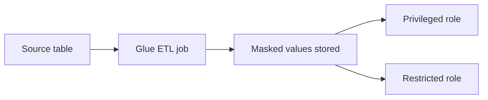
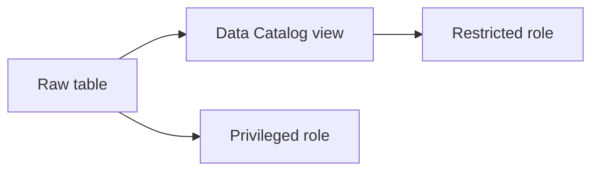
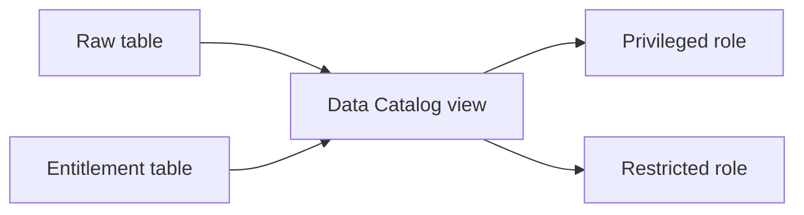

# Data Masking in Lake Formation

## What data masking is

Data masking replaces a sensitive value with a substitute that is safe for a wider audience, while leaving the column itself in place. For example, a social security number could return `NULL`, an email address returns `j***@example.com`, a customer name returns a hash. The column still exists, still has a name and a type, and still appears in the result set. 

Teams reach for masking when one dataset has to serve audiences with different rights to it. A marketing analyst needs to segment customers by loyalty tier and country, and needs a `customers` table to do it, but has no business reason to read anyone's social security number. Masking lets that analyst query the same table as the engineer who does have that right, without a curated extract per audience and without the raw value ever reaching the analyst's result set. It also keeps existing queries and dashboards working, because the shape of the data does not change. Deterministic masking goes further: a hashed `name` still joins and groups correctly, so aggregate work continues to produce the right answers over values nobody can read.

## Data masking using Glue Data Catalog and Lake Formation

Lake Formation's grant model decides *whether* a column is returned to a caller. It does not decide *what value* comes back in a column that is returned. There is no grant, LF-Tag, or data filter that says "return this column, but transform its contents first." A column that is granted comes back with the value stored in the table.

That is a functional gap rather than a design position, and it is the reason this sub-topic exists. Until Lake Formation offers masking as a first-class feature, the transformation has to happen somewhere else: computed ahead of time by a pipeline and stored, or applied at query time by a view in front of the table. Three approaches cover the useful combinations, and they differ mainly in when the masking runs and whether it varies per caller.

### Approach 1: precomputed masking with Glue ETL

A Glue ETL job computes the masked values ahead of time and writes them to storage. Lake Formation grants then decide which stored copy each persona reads. Two designs share this shape: the job either adds masked columns beside the raw ones in the same table, split by column-level LF-Tag grants, or writes a separate masked table, split by table-level grants. Either way the masking is materialized before anyone queries it.

### Approach 2: masking view

A Glue Data Catalog view selects from the raw table and applies the masking in its `SELECT` list. The privileged persona is granted the table; the restricted persona is granted only the view, and needs no permission on the table underneath it. No pipeline runs and nothing is stored, so readers always see current data. Every reader of the view sees the same masked values.

### Approach 3: masking view with an entitlement table

The same view, with the masking decided per caller instead of fixed. The view joins an entitlement table keyed on the identity returned by `invoker_principal()`, so one view serves principals with different rights and both personas query the same object. Adding or changing someone's entitlements is a row edit rather than a grant change.

## Comparing the three approaches

Read this table alongside the implementation pages rather than instead of them; each page explains its own trade-offs in more detail.

| Dimension | Approach 1: precomputed with Glue ETL | Approach 2: masking view | Approach 3: masking view with entitlement table |
|---|---|---|---|
| Engine support | Any engine honoring LF grants | Athena, Redshift, Spark on EMR Serverless, Spark on Glue 5.0 | Athena only, because `invoker_principal()` exists only there |
| ETL required | Yes | No | No |
| Data duplication | Masked columns, or a second table | None | None |
| Freshness | As fresh as the last ETL run | Always current | Always current |
| Masking varies per caller | No | No | Yes |
| Changing who sees what | Re-grant permissions | Redefine the view, or grant a different view | Edit a row in the entitlement table |
| Column names stable across personas | Same-table variant: no. Separate-table variant: yes | Yes | Yes |
| Impact on existing consumers | Queries must change: a new column name, or a new table name | Queries must change: a new object in the `FROM` clause | None; both personas keep querying the same object |
| Storage cost | One extra column per masked column, or a full second copy | None | None |
| Query cost | None beyond the table scan; masked values are materialized | Masking expressions evaluated per query | Masking expressions plus an entitlement join per query |
| Operational surface | A Glue job, plus LF-Tag or table grants | One view definition per masking scheme, one per dialect if multi-engine | A view definition plus an entitlement table to maintain and protect |
| Where enforcement lives | Lake Formation grants | The view definition, with Lake Formation granting the view | The view definition plus the entitlement table, with Lake Formation granting the view |

Data Catalog views are readable from Amazon Redshift, Athena engine version 3, Apache Spark on EMR Serverless, and Apache Spark on AWS Glue 5.0, so Approach 2 is not limited to Athena. Each engine reads its own SQL dialect, though, so a view created from Athena needs a Redshift-dialect definition added with `ALTER VIEW` before Redshift can read it. Only Approach 3 carries a hard single-engine restriction, because `invoker_principal()` exists nowhere but Athena.

### Cost considerations

The approaches divide on when the masking runs, and that decides which side of the bill it lands on.

Approach 1 masks once per ETL run and stores the result. The recurring cost is Glue job time plus storage, both scaling with the size of the dataset and how often the pipeline runs, not with how often anyone queries. Readers pay nothing: a masked column is an ordinary materialized column. Between its two variants, masked columns in the same table add one column per masked column, while a separate masked table duplicates every row and every public column alongside them, so the separate table costs more to store and more Glue time to write for the same rules.

Approaches 2 and 3 store nothing and run no pipeline, so they have no write-side cost at all. They move it to read time. A masking view evaluates its masking expressions on the rows each query returns. Adding an entitlement table puts a join and an `invoker_principal()` call on top of that, so Approach 3 is the most expensive of the three per query. On engines billed by data scanned, the join adds the entitlement table to the scan; on engines billed by compute time, the per-row branching adds to it. Either way the cost repeats per query, scaling with read volume rather than data volume.

Which is cheaper depends on the ratio between the two. A large table queried a few times a day favours a view, since precomputing masked copies of data nobody reads is waste. A table under constant dashboard load favours precomputing, because paying once per ETL run beats paying on every dashboard refresh. Keeping an entitlement table small enough for the engine to broadcast it limits the join cost in Approach 3, but does not remove the per-row evaluation.

Measure this against your own workload before committing. Nothing here substitutes for running the query pattern you actually have against a table the size you actually have.

## Choosing an approach

**Start with Approach 2, the masking view.** It reaches the masked outcome with no pipeline, no duplicated data, and no staleness window, and it works on every engine that can read a Data Catalog view. The other two earn their place only against a specific requirement it cannot meet.

Use **Approach 3** when the masking has to vary by caller: several principals reading one view with different rights, or entitlements that change often enough that editing a table beats issuing a grant. It is also the only approach that leaves existing consumers untouched, since every persona queries the same object and the masking changes underneath them, which matters when there are more dashboards and saved queries than you can realistically track down. The price is that readers must be on Athena, plus a join on every query and an entitlement table that is itself an access-control policy to protect.

Use **Approach 1** when precomputing is what you need, in any of these cases:

- Consumers run on engines that cannot read a Data Catalog view, or you would rather not maintain a view definition per SQL dialect.
- The read volume is high enough that paying per query costs more than paying per ETL run.
- The masking is expensive to compute, or cannot be expressed in the engine's built-in functions, since Data Catalog views do not support UDFs.
- A pipeline is already producing this table, and adding masked columns to it costs nothing extra.

Within Approach 1, choose the same-table variant when a downstream tool is pinned to one table name, and the separate-table variant when you want one query definition to work for both personas.

Read the implementation pages for the mechanics of each:

- [Precomputed masking with Glue ETL](precomputed-masking.md), covering both variants, the PySpark transforms, and the LF-Tag and grant design for Approach 1.
- [Masking view](masking-view.md), covering the view definition, definer semantics, and multi-engine dialects for Approach 2.
- [Masking view with an entitlement table](glue-views-entitlement-table.md), covering `invoker_principal()` and the entitlement table for Approach 3.

## The shared example

All three implementation pages use the same fictitious table and the same two personas, so the mechanics of each approach can be compared against a fixed baseline.

Table `customers` in database `sales`:

| Column | Classification |
|---|---|
| `customer_id` | Public |
| `name` | PII |
| `email` | PII |
| `ssn` | PII |
| `city` | Public |
| `country` | Public |
| `loyalty_tier` | Public |

Two IAM roles stand in for personas:

- `DataEngineerRole`, the privileged persona, sees raw PII: the real `name`, `email`, and `ssn` values.
- `MarketingAnalystRole`, the restricted persona, sees masked values only.

Everything outside those three PII columns is public, and both personas see it unmasked.

Each PII column is masked a different way, so that one worked example covers all three of the masking types described below:

| Column | Masking type | Restricted persona sees |
|---|---|---|
| `ssn` | Full redaction | `NULL` (variant: last-4 as `***-**-6789`) |
| `email` | Partial reveal | `j***@example.com` |
| `name` | Hashing | `5e88...`, a hex digest |

The rules are identical on every page; the function names are not. Approaches 1 and 2 run in PySpark, where the hash is `sha2(col("name"), 256)`. Approach 3 runs in Athena SQL, which has no `sha2` and needs `to_hex(sha256(to_utf8(name)))` instead. Each page uses the correct form for its engine.

## Masking types

### Full redaction

The value is replaced outright, with `NULL` or a fixed placeholder. Nothing about the original survives, so nothing about it can be inferred. Use it when the consumer needs the column to exist but has no legitimate use for any part of its contents, which is the usual case for a social security number.

A variant keeps a small fragment for operational use, such as `***-**-6789`, so a support agent can confirm which record they are looking at without reading the whole number. That fragment is real data, so treat the variant as a deliberate partial disclosure rather than as redaction.

### Partial reveal

Enough of the value survives to be useful, and the rest is withheld. `jane.doe@example.com` becomes `j***@example.com`, which is enough for an agent to recognize an address a customer reads out, and not enough to contact them. Phone numbers are commonly handled the same way, keeping the last four digits.

Partial reveal leaks by design, and how much it leaks depends on the data. One character of an email local part is weak evidence; a full birth year, or the last four digits of a number issued sequentially, can be strong evidence when combined with the public columns sitting next to it. Decide what the retained fragment is for before choosing how much to retain.

### Hashing

The value is replaced with a deterministic digest, such as SHA-256 over the raw bytes. The same input always produces the same output, so joins, `GROUP BY`, and distinct counts over the masked column keep returning correct results even though no reader can recover a name from it. That property is what makes hashing the right choice for `name` in the shared example: the analyst can count customers per country without learning who they are.

Hashing a low-cardinality or guessable column provides less protection than it appears to. An unsalted digest of a value drawn from a small set can be reversed by hashing every candidate and comparing, so a hashed `country` column protects nothing. Hashing is appropriate for high-cardinality values, and a salt shared across the pipeline raises the cost of that attack on the rest.

### Encryption and tokenization are out of scope

Encryption and tokenization also substitute a value, and unlike hashing they are meant to be reversible: a privileged consumer is supposed to be able to recover the original, given a key or a lookup in a token vault. That reverse path is what puts them outside these three patterns.

Recovering the value at query time means calling a decryption or detokenization function inside the query, which means a user-defined function. Data Catalog views do not support UDFs in the view definition, so Approach 3 cannot express the reverse direction at all. Approaches 1 and 2 could store an encrypted column instead of a masked one, but the privileged persona would then need the UDF and the key in whatever engine it queries from, and every consumer holding both is a consumer that can produce plaintext. At that point the control is key management rather than Lake Formation permissions, and the masking patterns here stop being the mechanism that protects the data.

If reversible protection is the requirement, treat it as an encryption design and keep Lake Formation grants for deciding who reaches the ciphertext.

### Masking versus dropping the column

Lake Formation already does something adjacent to masking natively: a column-level grant or LF-Tag policy that omits `ssn` removes it from the result set entirely. The caller cannot read the column, reference it in a `WHERE` clause, or see a placeholder where it used to be.

The two behave differently for consumers, which is what makes the choice between them a real one. Column exclusion changes the result schema, so a query or dashboard referencing `ssn` fails, because there is no such column to reference. Masking preserves the schema and changes only the values, so the same query keeps running and `ssn` keeps appearing, holding a value the reader is allowed to see.

Column exclusion needs no pipeline, no view, and no extra grants, so prefer it when the restricted consumer has no need for the column in any form. Masking earns its cost when the consumer needs the column to exist: when a downstream tool expects a fixed schema, when the masked value has to join or aggregate correctly, or when a partial fragment of the original is genuinely useful.
