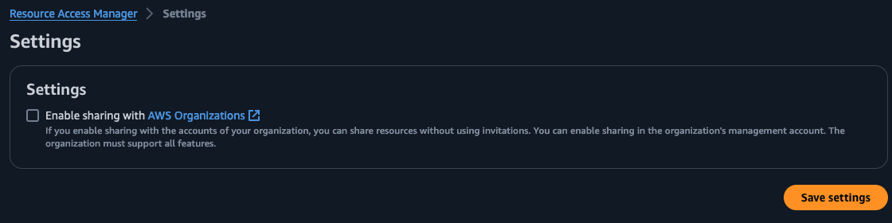

# General best practices for data sharing

## Transitive Sharing

Sharing of catalog objects across accounts using Lake Formation is not transitive. For example, if account A shares a database to account B, then account B cannot share it with account C. In this case, account A have to share the database with account B and account C individually. This is designed to maintain secure ownership of the data assets for the producer account. 

## Cross account sharing scope and AWS RAM shares

While sharing a database or table using Lake Formation, we recommend sharing to the AWS Organization units, Account ids and AWS IAM Principals in external account, in that order. Setting up and sharing with AWS Organizations provides an option in the AWS RAM to enable sharing with AWS Organizations. A screenshot is shown below. 

Enabling sharing with AWS Organizations auto-accepts the RAM invites created by Lake Formation. 

* If resources are shared at account level, then the  shared resources are visible to the Lake Formation admin on the consumer account, without having to accept the RAM invites. Using automation, you can create resource links and cascade permissions to additional users in the consumer account.
* If resources are shared directly to a cross account IAM principal, the shared resources are not visible to the Lake Formation admin in the recipient account. The IAM principal in the recipient account would see the shared resources. For the IAM principal level cross account share, the recipient principal should have permissions to create resource links- either create database permissions for creating resource link of a shared database or create table permission inside a database for creating resource link of the shared table. 

When you share a database or table through Lake Formation from one account to another, we recommend to share at the Database level instead of individual table level share wherever you can. This is because you will need to create a resource link on the shared resource on the consumer account, if you plan to use Athena or Redshift Spectrum for querying the shared resource. Creating a database resource link is much easier and all tables could be referenced using rl_source_database.source_tablename. This is easier compared to creating resource links for individual shared tables.

## Resource Links

* Athena and Redshift Spectrum require a resource link to query a cross account shared resource - either a database resource link or a table resource link. This is because Athena SQL query editor and Redshift Query Editor V2 console does not provide options to directly access the shared database or table names, which are not part of the consumer or recipient account catalog. Also, SQL queries cannot refer to the catalog id of the database and table names. On the other hand, a resource link is an object in the recipient account’s catalog  that points to the shared resource. Hence, Athena and Spectrum queries can use a resource link to refer to the shared resource. 
* Spark jobs in Glue ETL and EMR can refer to the shared resource by providing the catalog id of the source account. Hence resource links are not required if your workflow uses only Glue ETL and EMR. 

## Recipient account considerations

Data sharing through Lake Formation requires few actions to be performed on the consumer or recipient account side. These can be automated but cannot be avoided totally. 

* For example, if Athena and/or Redshift Spectrum are used for querying, consumer account data lake admin has to create the resource link for the shared resource. Then, the data lake admin has to cascade permissions to additional users in the consumer account on 3 objects - permissions to describe the resource link, permissions to describe the source data base and permissions to select on the source tables. If Glue ETL and/or EMR is used, then the consumer data lake admin has to cascade DESCRIBE and SELECT permissions only on the source database and source tables. 
* If the resources are shared with a new account first time, in Lake Formation cross account sharing Version 3 and higher, there will be two RAM invites sent from the owner to the consumer account - one for database level and one for table level. The consumer account has to accept both the RAM invites if AWS Organization is not set up as described earlier. Lake Formation users using automation to add and share resources could pass the RAM share ARN created by Lake Formation for each cross account share from producer to consumer. Consumer could verify the passed ARN with the ARN showing up in their AWS RAM under ‘Resources shared with me’ and accept the RAM invite. For any additional resources shared between the same producer and consumer, the new databases and tables are added to the already accepted RAM share. No further action is needed from the consumer admin.  

