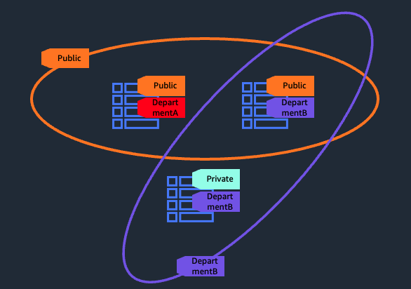
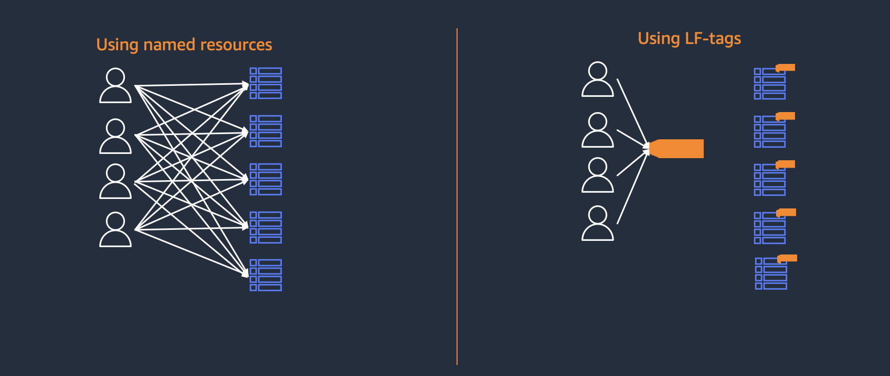
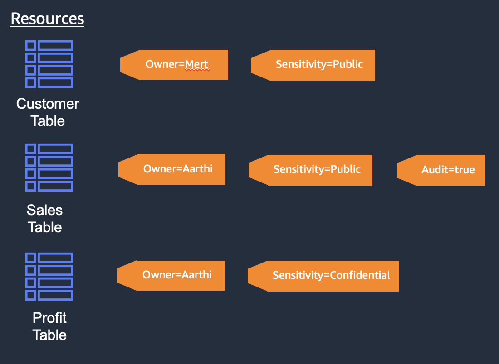

# Lake Formation Tags (LF-Tags) Basics

## Named Resource policies vs LF-tag policies

When creating an access policy within Lake Formation, there are 3 parts:
1) the principals (eg. IAM users, IAM roles, external accounts, SAML users/groups, etc) that you want to create permissions to. 
2) the resources you want to provide access to (eg. database db1, table tableA, etc)
3) the permissions you want to grant (eg. SELECT, DESCRIBE, ALTER, etc on a table)

The difference between Named Resource policies and LF-Tag policies is #2, the resources you want to provide permissions on. 

With Named Resources policies, you specify a specific resource (database, table, column, etc). With LF-Tags, you provide an LF-Tag expression which is used to match to resources for permissions. This makes LF-Tags much more scalable as you can grant permissions on many resources at once and permissions are updated accordingly as tags on resources are added, changed or removed. 

## Why use LF-Tags?

LF-Tags is a mechanism that can be used to group similar resources together, and permission on the group of resources. For example, if you have multiple databases and tables that are used by a wide variety of different groups of users, you can tag databases and tables that own those resources, and grant full read-write permissions to those resources using a single grant. 

Using LF-Tags can greatly simplify the number of grants over using Named Resource policies. See below as an example:

In the above example with 4 users and 5 tables, if you were use Named Resources policies, you would need to issue 20 grants. However, if you use LF-tags, and tagged all the tables with the same LF-Tag, you would need only one grant for each user to the tag for a total of 4 grants. If there were 100's of users and 1000's of resources, you would need 100*1000=100000 grants using named resources, but 100 grants for each user, and 1000 tagging operations for each resource.

LF-Tags also hierarchical. If you tag a database, all tables and columns within the database would inherit the LF-Tag. If you tag a table, then all columns would inherit the tags. You can also override inherited tags, so if you tag a database with tag AccessLevel = 'public', but want to change the tag value for a table to AccessLevel = 'private', then the table and all columns would override that value. 

## How LF-Tag expressions work

When granting permissions using LF-Tags, you need to provide a LF-Tag expression. This expression, if it evaluates to true, will grant a principal to the resource. LF-Tag expressions contain one or more LF-Tag names, and for each LF-Tag, one or more values. Each tag name is AND'ed in the expression and each lf-tag value is OR'ed. For example, LF-Tag1 = 'abc' AND LF-Tag2 = ('edf' OR 'ghi'). LF-Tags cannot be OR'ed.

Let's look an example: 

With the above example, we have three tables (although they can be columns or databases as well).

If you were to create a grant with the LF-Tag expression of Sensitivity = "Public", then this expression would be true for the Customer table, and Sales Table. Notice that not all tags need to evaluate to true for the resource to be granted.

If you were to create a grant with the LF-Tag expression Audit = "true", then only the Sales table would evaluate true. 

If you were to create a grant with the LF-Tag expression of Owner = 'Aarthi' and Audit = 'true', then again, only the Sales table would evaluate to true.

## Limitations
Before using LF-Tags, please see Lake Formation documentation for current limitations located at https://docs.aws.amazon.com/lake-formation/latest/dg/TBAC-notes.html