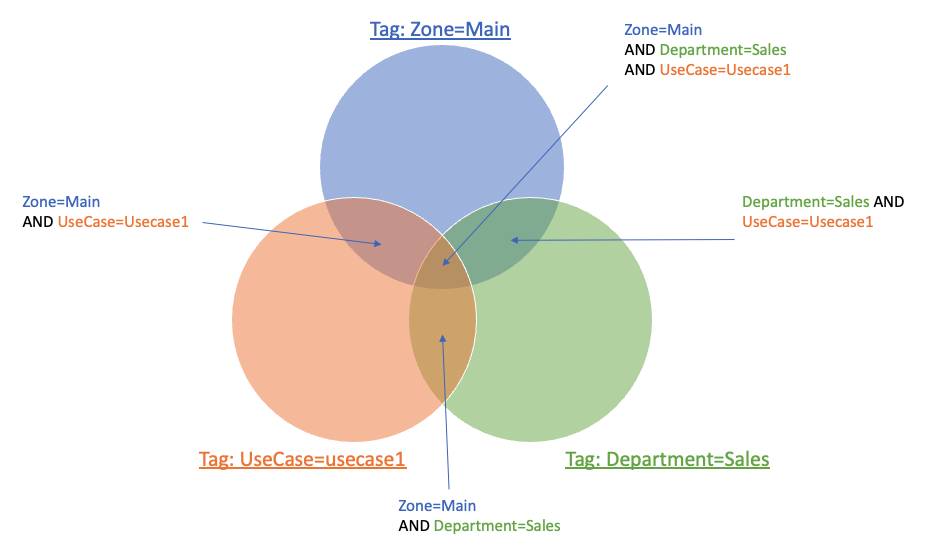

# Developing an LF-Tag Ontology

Using LF-Tags can make permissioning much easier and scalable than using named resource policies. However, it may be a little tricky to figure what your LF-Tag ontology should look like. Here are some approaches and best practices when trying to figure out a tag ontology.

1. The best way to think of LF-Tags is that it's a mechanism to group resources together which then can be permissioned on. Permissions are granted based on the intersection of the tags on the group of  resources like the diagram below:

2. There are two high level approaches you can take. Starting from scratch or trying to replicate the current permissions using LF-Tags. By starting from scratch, your design will tend to be simpler and more intuitive because the design is not constrained to fit an existing permissioning model. The draw back of this approach is that some users may get more permissions or less permissions than before. Some customers want this as this is an opportunity to simplify the permissions model. 
3. Start with the permissions requirements, document it and build on top of that. From your requirements, what categories can you create? For example, sensitivity of data and what levels exist? For example, PII/Confidential/Public level of data. What are the groups of users that need access to the same resources? For example, users within an department within my organization? What different roles are there and how different levels of access, eg. Data Stewards, Data Engineers, Data Scientists, etc. Do I need finer grained permissions such as users within projects need access to only project level resources?  See https://aws.github.io/aws-lakeformation-best-practices/lf-tags/common-ontologies/ for common tags that other users have created.
4. Create a table in a spreadsheet with roles/users on one axis and resources (tables/databases) in another axis. Mark which resources should be accessible to which roles. This will help you visualize and identify patterns that could lead to additional categories or help simplify permissions.
5. One important thing to remember is that LF-Tags can be used to define very broad range of resources or very fine range of resources. One LF-Tag can be used to group a very large group of resources, while additional tags can further split the large group into smaller groups. Having a balance to both will ensure that your ontology does not get too complex, and get too simple.
6. Lastly, although it's impossible to predict the future, consider any additional requirements that may come in the future and how that may impact your ontology. 

#### Simple Example:

I have AnyCompany and they have the following objects in their Catalog:

| Database | Table |
|:------|:---------|
| marketing | ads |
| marketing | ad_compaigns |
| sales | inventory |
| sales | customer_sales |
| hr | people |
| hr | salaries |

The roles that we have that want to access these data sets are:

* marketing data engineers - has ability to read/write to any marketing datasets
* marketing data analysts - has the ability to read only to any marketing datasets
* sales data engineers - has ability to read/write to any sales datasets
* sales data analysts - has the ability to read only to any sales datasets
* CFO office analysts - has the ability to read only to any marketing and sales datasets
* HR engineers - has the ability to read/write only to any HR datasets.
* HR analysts - has the ability to read only to any HR datasets but only non-confidential information. Salaries are considered confidential. 
* HR managers - has the ability to read only to HR datasets, both confidential and non-confidential data.
* data platform engineers - has the ability to describe all datasets, but not able to read/write to them. 

They are required to have the following access:

| |  | marketing data engineers | marketing data analysts | sales data engineers | sales data analysts | CFO office analysts | HR engineers | HR analysts | HR Managers | data platform engineers |
|:--|:--|:--|:--|:--|:--|:--|:--|:--|:--|:--|
| marketing | ads | read/write | read |  |  | read |  |  |  | describe |
| marketing | ad_compaigns | read/write | read |  |  | read |  |  |  | describe |
| sales | inventory |  |  | read/write | read | read |  |  |  | describe |
| sales | customer_sales |  |  | read/write | read | read |  |  |  | describe |
| hr | people |  |  |  |  |  | read/write | read | read | describe |
| hr | salaries |  |  |  |  |  | read/write |  | read | describe |

From this, we can group some of these accesses together:

* Department = Marketing, Sales, HR where Marketing is for the marketing database, Sales for the sales database, and HR for the hr databases.
* Roles = Engineers, Analyst, Platform where Engineers have read/write access, analysts have read access, and platform that has describe access
* Confidentiality = Public,  Confidential where public is anyone can read the data, Confidential is data restricted to only a subset of the columns in a table.

From the information above, we tag the resources in the following way: 

| |  | Tag 1 | Tag 2 |
|:--|:--|:--|:-- |
| marketing | ads | Department = Marketing | Confidentiality=Public |
| marketing | ad_compaigns | Department = Marketing | Confidentiality=Public |
| sales | inventory | Department = Sales | Confidentiality=Public |
| sales | customer_sales | Department = Sales | Confidentiality=Public |
| hr | people | Department = HR | Confidentiality=Public |
| hr | salaries | Department = HR | Confidentiality=Confidential |

**Note 1:** if there are any confidential columns in these datasets, you can set the table as Confidentiality=Public and override the sensitive columns to Confidentiality=Confidential.
**Note 2:** Tables inherit the Tags from their databases, and columns inherit their tags from their table. In this case, we would set the Department tag to only the respective database and the tables will inherit the values.

And then we can grant permissions in the following way:

| Principal: | Actions | LF Expression Grant |
|:--|:--|:--|
| marketing data engineers | read/write | Department = Marketing |
| marketing data analysts | read | Department = Marketing |
| sales data engineers | read/write | Department = Sales |
| sales data analysts | read | Department = Sales |
| CFO office analysts | read | Department = (Marketing OR Sales) |
| HR engineers | read/write | Department = HR |
| HR analysts | read | Department = HR and Confidentiality = Public |
| HR manager | read | Department = HR |
| data platform engineers | describe | Department = (Sales OR Marketing OR HR) |

**Note 1:** you will notice that Confidentiality are not specified for many of the grants above. If Confidentiality is not specified, then permission is granted to the resource, regardless if the resource has the tag or not and its values. 

**Note 2:** for some complex use cases, you can grant to multiple subsets of resources using multiple grants. For example, if the data platform engineers needed read/write access to the sales and marketing databases, but could only need describe permissions to the hr databases, this can be achieved by having one grant for the sales and marketing databases for read/write access, and a separate grant to the HR database for describe.

For a more complex example, please see https://aws.github.io/aws-lakeformation-best-practices/lf-tags/example-usecase/ 
