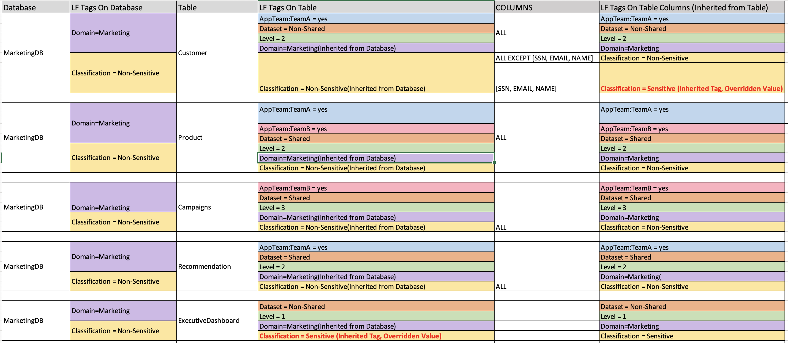
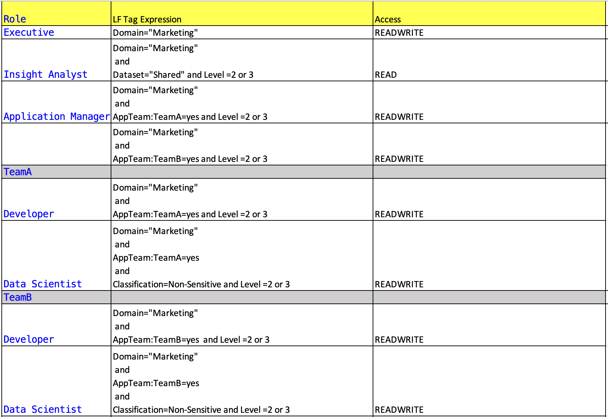

# Example Customer use case
Customer X has marketing departing with following personas and requirements:

- Executive : Should be able to access all the marketing datasets

- Insight Analyst : Should have read access to all non-sensitive datasets that are shared with the department.

- Application Manager: Manages 2 teams - AppTeamA & AppTeamB and should have readwrite access to all the datasets they use.

    - AppTeamA : 
        Developers      : Needs readwrite access to dataset that is used by the project A.
        Data Scientists : Needs readwrite access to non-sensitive datasets that is used by the project A

    - AppTeamB :
        Developers      : Needs readwrite access to dataset that is used by the project B.
        Data Scientists : Needs readwrite access to non-sensitive datasets that is used by the project B
    
Marketing departments have following datasets to cater to the needs of the users in the MarketingDB database:

| Table Name | Table Description |
|:-----------|:------------------|
|Customer|Contains customer details including sensitive information|
|Product|Contains product details that are maintained by the department.|
|Campaigns|Contains campaign information that are available for each of the product.|
|Recommendation|Contains customer preferences and recommendation based on user profile.|
|ExecutiveDashboard|Contains revenue reports for executive access.|

Following LF Tag Ontologies are defined for the datasets:

|Tag Key|Tag Values|
|:------|:---------|
|Domain| <ul><li>Marketing - the only allowed value for now</li></ul>|
|level| <ul><li>1 - Executive only</li><li>2 - Non-executive users in the department</li><li>3 - open to all users.</li></ul>|
|Dataset|<ul><li>Shared - Common datasets that are shared with other department.</li><li>Non-Shared - Non-shared datasets that are specific to the department.</li></ul>|
|Classification|<ul><li>Restricted  - Contains sensitive data</li><li>Public      - Contains non-sensitive data</li></ul>|

Project team A and team B might have overlapping dataset needs for their usage. Say for example: If we have Tag AppTeam with values as TeamA, TeamB and they need access to same table. The limitation that currently exist is that you can't associate/tag multiple values of the same tag key to given table. Workaround is to create Tag for each team as shown below:

|Tag Key|Tag Values|
|:------|:---------|
|AppTeam:TeamA| yes - For datasets used in Project A|
|AppTeam:TeamB| yes - For datasets used in Project B|

Tags are associated with resources as shown below:

Resources access are granted to user using LF Tags expression as shown below:

Let us review the LF Tags expression permission granted to the personas and effective resource access available for them

**Executive**           - gets read write access to all tables under MarketingDB.

**Insight Analyst**	    - gets read access to product and campaigns table which are shared dataset and are available to non-executive or all users.

**Application Manager** - has 2 sets of permissions granted to provide access to both AppteamA and AppteamB dataset. So the effective permission is union of all the resources granted to each team which includes readwrite access to customer,product,campaigns,recommendation tables.

**AppTeamA:**

*Developer*           - gets read write access to tables that are tagged with AppTeam:TeamA - customer,product,recomendations.

*Data Scientists*     - gets read write access to non-sensitive data in tables that are tagged with AppTeam:TeamA - customer(all columns except SSN,EMAIL,NAME),product,recomendations.

**AppTeamB:**
*Developer*           - gets read write access to tables that are tagged with AppTeam:TeamB - product, campaigns

*Data Scientists*     - gets read write access to non-sensitive data in tables that are tagged with AppTeam:TeamB - product, campaigns.

